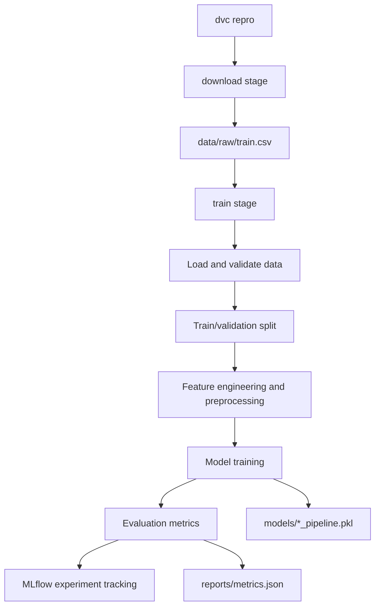

# Titanic MLOps Project Workflow

This document explains how the main project components work together and what each part is responsible for.

## Big Picture

The project trains a Titanic survival classifier using a reproducible MLOps workflow.

The main tools are:

- **DVC**: runs the pipeline stages and tracks data, models, metrics, and params.
- **Hydra**: loads structured configuration from the `conf/` directory.
- **params.yaml**: stores experiment parameters that DVC watches.
- **scikit-learn**: builds the preprocessing and model pipeline.
- **MLflow**: logs experiment parameters, metrics, model artifacts, and registered models.
- **joblib**: saves a local copy of the trained pipeline.

The normal entry point is:

```bash
dvc repro
```

DVC then runs the stages defined in `dvc.yaml`.

## End-to-End Flow



## DVC Pipeline

The pipeline is defined in `dvc.yaml`.

### `download` Stage

The `download` stage runs:

```bash
uv run python trainer.py --config-name config stage=download
```

It depends on:

- `src/training/data/download_data.py`

It watches these params from `params.yaml`:

- `data.competition_name`
- `data.raw_dir`
- `data.overwrite`

It produces:

- `data/raw/train.csv`

### `train` Stage

The `train` stage runs:

```bash
uv run python trainer.py --config-name config stage=train
```

It depends on:

- `src/training/train.py`
- `src/training/features/preprocess.py`
- `src/training/features/transformers.py`
- `src/training/pipeline.py`
- `src/training/evaluate.py`
- `data/raw/train.csv`

It watches these params from `params.yaml`:

- `training.test_size`
- `training.random_state`
- `model.name`
- `model.params`

It produces:

- `data/processed/`
- `models/`
- `reports/metrics.json`

## Configuration Layers

There are two main configuration sources.

### Hydra Configs

Hydra config files live in `conf/`.

Important files:

- `conf/config.yaml`: main Hydra config file.
- `conf/data/default.yaml`: default data paths and data settings.
- `conf/training/default.yaml`: default training settings.
- `conf/model/logistic.yaml`: Logistic Regression config.
- `conf/model/random_forest.yaml`: Random Forest config.
- `conf/mlflow/default.yaml`: MLflow tracking config.

Hydra loads `conf/config.yaml`, which then loads the selected default configs.

### DVC Params

`params.yaml` stores the values that DVC tracks for reproducible experiments.

The current model config shape is:

```yaml
model:
  name: random_forest
  params:
    logistic:
      C: 1.0
      max_iter: 1000
      random_state: 42
    random_forest:
      n_estimators: 200
      max_depth: 8
      random_state: 42
```

`model.name` selects which model to train.

`model.params.<model_name>` stores that model's hyperparameters.

For example, if:

```yaml
model:
  name: random_forest
```

then the training code reads:

```yaml
model.params.random_forest
```

## Main Entrypoint: `trainer.py`

`trainer.py` is the orchestration script. It decides which stage to run.

Its main responsibilities are:

- Load Hydra config.
- Merge values from `params.yaml`.
- Configure MLflow.
- Run the requested stage:
  - `download`
  - `train`
  - `all`

The stage is selected like this:

```bash
python trainer.py stage=download
python trainer.py stage=train
python trainer.py stage=all
```

DVC uses the same script, but passes the stage from `dvc.yaml`.

## Data Components

### `src/training/data/download_data.py`

This file downloads the Titanic dataset and stores it under `data/raw/`.

Main function:

```python
download_data(cfg)
```

It reads settings such as:

- `cfg.data.raw_dir`
- `cfg.data.competition_name`
- `cfg.data.overwrite`

### `src/training/data/load.py`

This file loads and validates raw data.

Main function:

```python
load_raw_data(cfg)
```

It reads:

```yaml
data.raw_train_path
```

It validates that required Titanic columns exist, such as:

- `PassengerId`
- `Survived`
- `Pclass`
- `Name`
- `Sex`
- `Age`
- `Fare`
- `Embarked`

It also contains:

```python
save_processed_data(...)
```

which writes train/validation splits into `data/processed/`.

## Feature Engineering and Preprocessing

Feature logic lives in:

- `src/training/features/transformers.py`
- `src/training/features/preprocess.py`

### Custom Transformers

`transformers.py` contains custom scikit-learn compatible transformers.

`TitleExtractor`:

- Extracts title from passenger name.
- Example: `Braund, Mr. Owen Harris` becomes `Mr`.
- Groups rare titles into `Rare`.

`FamilySizeExtractor`:

- Creates:

```python
FamilySize = SibSp + Parch + 1
```

`IsAloneExtractor`:

- Creates a binary feature:

```python
IsAlone = 1 if FamilySize == 1 else 0
```

### Preprocessor

`preprocess.py` builds the preprocessing pipeline.

Numeric features:

- `Age`
- `Fare`
- `SibSp`
- `Parch`
- `FamilySize`
- `IsAlone`

Numeric steps:

- Fill missing values with median.
- Scale using `StandardScaler`.

Categorical features:

- `Pclass`
- `Sex`
- `Embarked`
- `Title`

Categorical steps:

- Fill missing values with most frequent value.
- Encode categories using `OneHotEncoder`.

The custom feature engineering steps run before the column transformer.

## Model Selection

Model selection lives in:

```text
src/training/train.py
```

The important functions are:

```python
get_model_params(cfg)
get_model(cfg)
```

`get_model_params(cfg)` reads params for the selected model.

`get_model(cfg)` creates the correct scikit-learn estimator.

Currently supported models:

- `logistic`: `LogisticRegression`
- `random_forest`: `RandomForestClassifier`

To switch models, update `params.yaml`:

```yaml
model:
  name: logistic
```

or:

```yaml
model:
  name: random_forest
```

## Training Pipeline

`src/training/pipeline.py` combines preprocessing and modeling into one scikit-learn pipeline.

The final pipeline shape is:

```text
Pipeline
|-- preprocessor
|   |-- title extraction
|   |-- family size extraction
|   |-- is alone extraction
|   `-- column transformer
|       |-- numeric preprocessing
|       `-- categorical preprocessing
`-- model
```

This is important because the saved model artifact includes both preprocessing and the trained model. That means prediction data can be passed in raw Titanic format, and the pipeline handles feature engineering automatically.

## Evaluation

Evaluation lives in:

```text
src/training/evaluate.py
```

Main function:

```python
evaluate_model(pipeline, X_val, y_val)
```

It computes:

- accuracy
- ROC-AUC
- F1 score

Metrics are saved to:

```text
reports/metrics.json
```

DVC tracks this file as a metrics output.

## MLflow Experiments

MLflow is configured in `trainer.py`.

The project sets:

- MLflow tracking URI
- MLflow experiment name

During training, MLflow logs:

- model name
- training split settings
- selected model hyperparameters
- evaluation metrics
- model signature
- input example
- trained model artifact
- `params.yaml`

The model is logged with:

```python
mlflow.sklearn.log_model(...)
```

The registered model name is:

```text
titanic-classifier
```

This lets MLflow keep versions of trained models in the model registry.

## Local Artifacts

The project writes several local outputs.

### Raw Data

```text
data/raw/train.csv
```

Created by the `download` stage.

### Processed Data

```text
data/processed/
```

Created by the `train` stage.

Contains:

- `X_train.csv`
- `X_val.csv`
- `y_train.csv`
- `y_val.csv`

### Model Files

```text
models/
```

Created by the `train` stage.

Example:

```text
models/random_forest_pipeline.pkl
```

This file is a joblib copy of the full scikit-learn pipeline.

### Reports

```text
reports/metrics.json
```

Contains the latest training metrics.

## Prediction

Prediction code lives in:

```text
src/prediction/predict.py
```

It loads a production model from the MLflow registry:

```text
models:/titanic-classifier/Production
```

Then it creates sample passenger rows and calls:

```python
model.predict(passengers)
model.predict_proba(passengers)
```

Because the saved artifact is a full pipeline, the prediction input should use the same raw columns used during training.

## Model Promotion

Model promotion code lives in:

```text
src/training/promote_model.py
```

It searches the MLflow experiment for the best run by ROC-AUC, finds the matching registered model version, and promotes that version to `Production`.

The intended workflow is:

1. Run training.
2. Compare runs in MLflow.
3. Promote the best model.
4. Use the production model for prediction.

## Common Commands

Install dependencies:

```bash
uv sync
```

Run full pipeline:

```bash
dvc repro
```

Run only download:

```bash
dvc repro download
```

Run only training:

```bash
dvc repro train
```

Run tests:

```bash
python -m pytest tests
```

Run linting:

```bash
ruff check
ruff format --check
```

## How to Add a New Model

To add a new model, update three places.

First, add params in `params.yaml`:

```yaml
model:
  name: gradient_boosting
  params:
    gradient_boosting:
      n_estimators: 100
      learning_rate: 0.1
      random_state: 42
```

Second, add model construction in `src/training/train.py`:

```python
elif model_name == "gradient_boosting":
    return GradientBoostingClassifier(
        n_estimators=model_params.get("n_estimators", 100),
        learning_rate=model_params.get("learning_rate", 0.1),
        random_state=model_params.get("random_state", 42),
    )
```

Third, update dependencies if the model needs a new package.

## What DVC Tracks vs What MLflow Tracks

DVC focuses on reproducibility of the pipeline.

It tracks:

- pipeline stages
- dependencies
- parameters
- data outputs
- model output files
- metrics files

MLflow focuses on experiment history.

It tracks:

- run parameters
- run metrics
- model artifacts
- model signatures
- model registry versions
- production/staging model states

Together:

- DVC answers: "How was this pipeline produced?"
- MLflow answers: "Which experiment performed best?"

